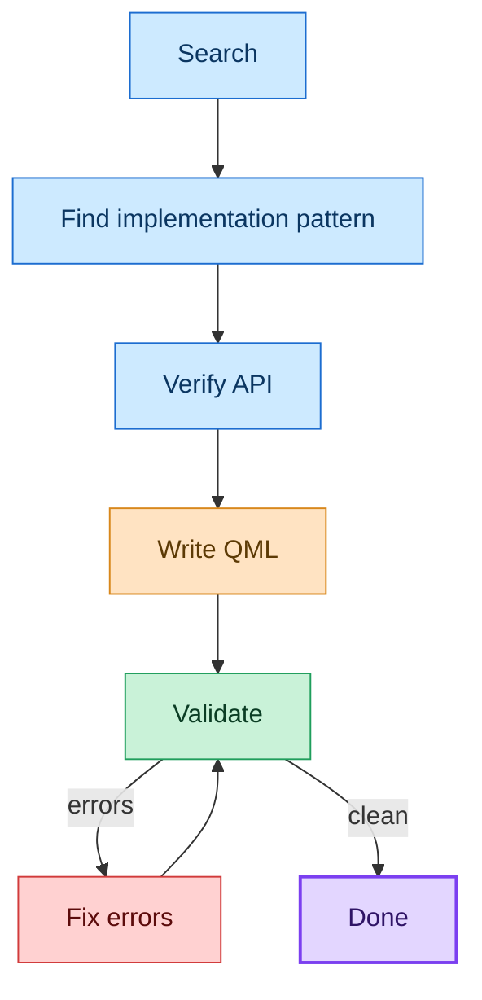

<!-- mcp-name: io.github.franklinnolasco7/quickshell-mcp -->

# quickshell-mcp

**An MCP server that connects AI coding agents to live Quickshell, QML, and Qt documentation.**

[](LICENSE)
[](https://pypi.org/project/quickshell-mcp/)
[](https://registry.modelcontextprotocol.io/v0.1/servers/io.github.franklinnolasco7%2Fquickshell-mcp/versions/latest)
[](https://github.com/franklinnolasco7/quickshell-mcp/blob/main/pyproject.toml)
[](https://codecov.io/gh/franklinnolasco7/quickshell-mcp)
[](https://github.com/franklinnolasco7/quickshell-mcp/actions/workflows/ci.yml)

---

Search APIs, discover implementation patterns, explain errors, validate QML, inspect a project, run tests, and profile a live shell **before** your agent writes or runs code.

## Why

Quickshell changes quickly, and AI coding agents can generate QML from outdated or incomplete training data. `quickshell-mcp` lets agents verify APIs against current documentation, find existing implementation patterns, validate generated QML, and inspect or test a project instead of guessing from memory.

> [!IMPORTANT]
> When sources disagree, official documentation always takes precedence.

## Table of Contents

- [Quick start](#quick-start)
- [What it provides](#what-it-provides)
- [External tools](#external-tools)
- [Knowledge sources](#knowledge-sources)
- [Configure](#configure)
- [Tools](#tools)
- [Typical workflow](#typical-workflow)
- [Advanced usage](#advanced-usage)
- [Source priority](#source-priority)
- [Caching](#caching)
- [References](#references)
- [Limitations](#limitations)
- [License](#license)

## Quick start

```bash
pip install quickshell-mcp        # or: uvx quickshell-mcp
```

Then point your MCP client at it (see [Configure](#configure) below).

Also installable via the [Model Context Protocol Registry](https://registry.modelcontextprotocol.io/v0.1/servers/io.github.franklinnolasco7%2Fquickshell-mcp/versions/latest).

<details>
<summary>Install from source</summary>

```bash
git clone https://github.com/franklinnolasco7/quickshell-mcp
cd quickshell-mcp
python3 -m venv .venv && source .venv/bin/activate
pip install -e .
```
</details>

<details>
<summary>Install with Nix</summary>

```bash
nix run github:franklinnolasco7/quickshell-mcp
```
</details>

<details>
<summary>Install with Docker</summary>

```bash
docker build -t quickshell-mcp .
docker run --rm -i quickshell-mcp     # speaks MCP over stdio
```
</details>

## What it provides

| | |
|---|---|
| **Quickshell docs** | Version-aware type references, guides, and changelogs |
| **Qt/QML docs** | QtQuick, Controls, Layouts, and other base types |
| **Official examples** | Working Quickshell example configurations |
| **Real-world implementations** | Searchable Caelestia, Noctalia, and dots-hyprland patterns |
| **Error explanations** | Grounded diagnosis of QML and Quickshell errors |
| **QML validation** | Static checks for types, properties, signals, imports, and version compatibility |
| **Version compatibility** | Whether an API or QML snippet works on a specific Quickshell release |
| **Migration** | Analyze what a QML config must change to keep working after an upgrade |
| **Component generation** | Minimal, source-grounded QML components from a plain-language description |
| **Project intelligence** | Analyze, map, search, and classify a project on disk |
| **Project validation** | Validate, lint, check compatibility, and migrate a whole project per file |
| **Runtime sessions** | Start and inspect isolated `qs` processes, opt-in and mutating |
| **Visual and UI inspection** | Windows, screenshots, UI tree, properties, and snapshots |
| **Runtime testing** | Machine-readable test steps, suites, and assertions against a live session |
| **Performance profiling** | Bounded sampling plus static component, binding, and timer analysis |
| **Desktop adapters** | Read-only Hyprland, PipeWire, D-Bus, and system inspection |
| **Knowledge 2.0** | Version diffs, API graphs, best practices, pattern comparison, provenance |
| **Intelligence** | Project memory, architecture recommendations, regression detection, task plans |
| **Agent orchestration** | Build, debug, migrate, test, and optimize a feature end to end |
| **Coding assistant** | One plain-language request routed through the right tools, returning a structured, source-grounded result |
| **CI entrypoints** | Headless validation, screenshot, runtime-test, compat, and migration scripts |

## External tools

Most tools need nothing beyond the `quickshell-mcp` package. The ones that inspect a real desktop detect their dependency at runtime and report it as unavailable when missing, instead of failing. This applies to runtime sessions, UI inspection, and the desktop adapters.

| Dependency | Used by |
|---|---|
| `qs` (Quickshell binary) | Runtime sessions, UI inspection, testing, `qs ipc` |
| `grim` | Screenshots |
| ImageMagick (`compare`, `identify`) | Screenshot diff, visual checks |
| `hyprctl`, `pw-cli`, `busctl` | Desktop adapters (each optional, degrades gracefully) |

The headless CI shell (`nix develop .#ci`) packages `quickshell`, `weston`, `grim`, and `imagemagick` for running runtime-test and screenshot jobs without a desktop.

## Knowledge sources

Six sources back the server: Quickshell docs, Qt/QML docs, official Quickshell examples, and three real-world shells (Caelestia, Noctalia, dots-hyprland). The shells are practical reference material, not authoritative API definitions. See [Source priority](#source-priority) for how conflicts resolve.

## Configure

**opencode** (`opencode.json`):

```json
{
  "mcp": {
    "quickshell": {
      "type": "local",
      "command": ["/absolute/path/to/quickshell-mcp/.venv/bin/quickshell-mcp"],
      "enabled": true
    }
  }
}
```

**Claude Desktop**: same JSON under `claude_desktop_config.json`, wrapped in `mcpServers`.

For HTTP transport, set `QUICKSHELL_DOCS_MCP_TRANSPORT=http` (plus optional `HOST`/`PORT`).

> [!TIP]
> Set `QUICKSHELL_DOCS_MCP_LOG=DEBUG` for verbose request logging on stderr.
>
> The `QUICKSHELL_DOCS_MCP_*` environment variable prefix is retained for backwards compatibility with earlier releases.

## Tools

For the full per-tool list, grouped by capability with mutating and high-risk tools flagged, see [docs/TOOLS.md](docs/TOOLS.md).

## Typical workflow



### Example

Instead of asking an AI agent to guess how to create a workspace indicator in Quickshell, the agent can search for the API, find existing implementations, verify the requested version, generate the QML, and validate it before running it:

```mermaid
flowchart LR
    A[quickshell_search_all] --> B[quickshell_find_pattern]
    B --> C[quickshell_list_versions /<br/>quickshell_get_type]
    C --> D[quickshell_generate_component]
    D --> E[quickshell_validate_qml]
    E --> F[quickshell_explain_error]

    classDef tool fill:#cdeaff,stroke:#1c6dd0,stroke-width:1px,color:#0b3661
    classDef action fill:#ffe3c2,stroke:#d8871b,stroke-width:1px,color:#5c3a05
    classDef debug fill:#ffd1d1,stroke:#d13b3b,stroke-width:1px,color:#5c0b0b

    class A,B,C tool
    class D,E action
    class F debug
```



## Advanced usage

<details>
<summary><b>Static validation, version compatibility, migration, component generation, and the coding assistant</b>: catch bad QML, verify API support per release, plan upgrades, generate components, or route a whole development task through the assistant</summary>

### Static validation

`quickshell_validate_qml` checks QML against the same Quickshell and Qt documentation indexes the other tools use. It catches:

- Unknown Quickshell and Qt types
- Unknown properties, methods, and signals
- Missing imports
- Obvious type mismatches
- APIs unavailable in the requested Quickshell version

> `quickshell_validate_qml` complements `qmlls`; it does not replace it. Dynamic JavaScript and local component resolution are outside its scope.

```json
{"source": "PanelWindow { foo: 123 }", "version": "latest", "filename": "panel.qml"}
```

### Version compatibility

`quickshell_check_compatibility` checks whether a Quickshell API, QML property/method/signal, type, or whole snippet works on a specific release. Pass one of `api`, `type`, or `code`; choose the release with `version` (or use `from_version`/`to_version` for a range).

It does not judge from the latest docs page alone. It cross-references the requested version's type index and pages plus the changelog, and returns `uncertain` when the evidence is not enough. Qt/QML types (Rectangle, Item, ...) show as `compatible` with `origin: "qt"`, because your Qt version sets their availability, not the Quickshell one.

```json
{"api": "PanelWindow.exclusiveZone", "version": "v0.2.0"}
{"api": "Quickshell.shellRoot", "version": "v0.3.1"}
{"code": "PanelWindow { exclusiveZone: 1 }", "version": "v0.1.0"}
```

The result includes the verdict, the version evidence (earliest/latest known), any rename or change with a likely replacement, the matching changelog entry, and cited documentation URLs.

### Migrating between versions

`quickshell_migrate` analyzes what a QML config must change to keep working when upgrading from one Quickshell version to another. Pass the QML source (or a single `api`/`type`), plus `from_version` and `to_version` (both required, ordered oldest to newest).

It reports every removed, renamed, deprecated, or changed API with severity, location, the old and new API, why it must change, a suggested migration, confidence, and a cited source. It also scans the breaking-change changelog entries between the versions that mention the referenced symbols, so a rename that landed at an intermediate release is reported with the version it landed in. Findings are classified `definite` (backed by the docs or changelog), `likely` (documented but low-impact, e.g. deprecation), or `manual_review` (evidence suggests a change but the exact migration is not provable).

The tool analyzes and recommends; it never rewrites code or files.

```json
{
  "code": "Quickshell { shellRoot: \"/tmp\" }\nPanelWindow { exclusiveZone: 1 }",
  "from_version": "v0.1.0",
  "to_version": "v0.3.1"
}
```

The report includes the overall verdict (`compatible`, `changes_required`, `uncertain`), the per-issue findings, and an ordered migration plan.

### Component generation

`quickshell_generate_component` turns a plain-language description into a minimal QML component, e.g. "Create a Hyprland workspace indicator", "animated volume OSD", "top bar with workspaces, clock and system tray", "popup control center", or "notification popup".

```json
{"description": "volume OSD", "version": "latest", "compositor": "hyprland"}
```

The generator searches for the request (using the same search and pattern tools as the rest), builds a small component from the section templates, then checks every Quickshell type and property/method it references against the requested version with `quickshell_check_compatibility` and runs the assembled QML through `quickshell_validate_qml`. An API that cannot be verified is shown in the result, not silently emitted, so the output never passes off an unverified API as valid.

The result includes the generated QML plus:

- `dependencies`: imports, required Quickshell types, and Qt types
- `verified_surface`: the documented properties/methods/signals of every type the component uses, so you can rewrite the QML against verified members
- `integration`: compositor and external-service requirements (Hyprland socket, PipeWire, a notification daemon, ...)
- `verification`: per-API compatibility verdicts and an overall `verified`/`unverified` flag
- `validation`: the diagnostics from the static validator
- `references`: documentation, official examples, and real-world implementations to compare against
- `assumptions`: the conservative choices made (default palette, unrecognized compositor, requested windows that were not embedded)

`compositor="hyprland"` generates Hyprland-specific types; any other value is noted and generates no compositor-specific code. A request that matches no template still returns `verified_surface` plus `references`, so you can compose the component yourself. Each generated file contains one top-level window: if a request mentions several windows (such as a bar and a notification popup), the primary one is generated and the rest are listed under `assumptions` instead of being nested. The tool writes nothing to disk.

### Coding assistant

`quickshell_coding_assistant` is an orchestration layer over the other tools, for tasks that span several of them. Give it one plain-language development request and it runs a fixed pipeline of stages: search, verify, generate, validate, migrate, research (provenance), and optionally execute. Each stage activates only the tools the request needs. The result is structured and source-grounded, with sections for understanding, relevant APIs, recommended approach, implementation references, compatibility, validation, remaining issues, sources, provenance, and a terminal `grounded_result`.

```json
{"request": "Build a Hyprland workspace bar"}
{"request": "Why is this PanelWindow failing?", "code": "PanelWindow { foo: 1 }"}
{"request": "Migrate this shell from v0.2 to v0.3", "from_version": "v0.2.0", "to_version": "v0.3.1"}
{"request": "Find an implementation of a volume OSD and adapt the pattern"}
```

Requests map to five intents, each running the relevant pipeline stages:

- **build** ("build/add/make a ...") delegates the search and verify stages to `quickshell_generate_component`, which runs them internally, and its validated QML becomes `grounded_result`.
- **debug** ("why is X failing?", "fix this error") runs search (`quickshell_explain_error`) and verify (relevant type page + compatibility), then validate (`quickshell_validate_qml`); `grounded_result` is the diagnosis and fix.
- **migrate** ("migrate/upgrade from vX to vY") runs search (breaking-change changelog when no code is given), validate against the target version, and migrate (`quickshell_migrate`); `grounded_result` is the ordered migration plan.
- **pattern** ("find an implementation ... and adapt it") runs search (`quickshell_find_pattern`, with a short excerpt of the top implementation) and verify (compatibility of the hinted APIs); `grounded_result` is the excerpt plus verified APIs.
- **research** ("what is X?", "how do I ...?") runs search (all sources) and verify (top type and guide pages + compatibility); `grounded_result` lists the resolved types and guides.

Execution is off by default: the assistant never modifies files. To let it apply an explicit, validated edit set, pass `permitted_execution=True` together with `edits=[...]` (same shape as `quickshell_apply_patch`) and a `project=` path. Non-permitted requests record an execution step and continue read-only.

Version and compositor come from the request text (`0.2`, `hyprland`) or from the `version`/`compositor`/`from_version`/`to_version` parameters. Loose version hints resolve at runtime against the published list. Each step runs in isolation, so a failing source shows up in `errors` instead of failing the whole request. The result carries an `orchestration` trace of the tools used and a deduplicated `sources` list. The `basis` tags on approach steps and the `verified` flag on API entries separate verified facts (from the official docs) from recommendations.

**When to use it:** multi-step development requests, or when you do not yet know which single tool fits. For a single, focused lookup (one type page, one error message, one version check) call the specific tool directly; it is cheaper and gives the raw answer.

</details>

<details>
<summary><b>Project, runtime, inspection, testing, performance, and agents</b>: work on a real project on disk and a live shell</summary>

### Project analysis

`quickshell_project_analyze`, `quickshell_project_map`, and `quickshell_project_find` read a project on disk without executing anything. Analysis marks unknown values explicitly, the map distinguishes confirmed from inferred edges (and reports cycles), and find searches project files with location and context. `quickshell_project_dependencies` classifies imports as required, optional, detected, or missing.

```json
{"project": "/path/to/shell"}
```

`quickshell_project_validate`, `quickshell_project_lint`, `quickshell_project_compatibility`, and `quickshell_project_migrate` run the same engines used by the single-file tools across every QML file, grouped by file and severity. Lint uses an extensible rule table; compatibility never overclaims runtime incompatibility; migrate produces machine-readable proposed edits and never writes.

### Runtime sessions

Runtime tools launch real `qs` processes in isolated XDG directories so a managed shell never touches your desktop session. They are opt-in and mutating, and require `qs` on PATH.

```json
{"project": "/path/to/shell", "entrypoint": "main.qml"}
```

`quickshell_runtime_start` returns a session id; `quickshell_runtime_status`, `quickshell_runtime_logs`, and `quickshell_runtime_ping` inspect it; `quickshell_runtime_stop` and `quickshell_runtime_reset` manage the lifecycle. Profiles are named and versioned via the ecosystem `quickshell_profile_*` tools and can be reused by start.

### Visual and UI inspection

`quickshell_windows`, `quickshell_ui_tree`, and `quickshell_ui_find` inspect a running session. Screenshots need `grim` and a compositor; UI introspection needs an `inspector` IpcHandler target in the shell. `quickshell_ui_set_property` and `quickshell_ui_invoke` mutate the session through IPC and return the old/new state; `quickshell_ui_eval` is high-risk (explicit opt-in, time-limited, output-bounded) and never touches the filesystem.

### Testing

`quickshell_test` runs a machine-readable test (steps then assertions, screenshot on failure); `quickshell_test_suite` runs several tests in isolation; `quickshell_assert`, `quickshell_test_macro`, and `quickshell_test_record` build up steps; `quickshell_test_report` summarizes a suite.

```json
{"session_id": "abc123", "tests": [{"name": "bar shows", "assertions": [{"type": "visible", "target": "bar"}]}]}
```

### Performance

`quickshell_profile` samples a session's CPU/memory over a bounded window. `quickshell_profile_component`, `quickshell_profile_bindings`, `quickshell_profile_timers`, and `quickshell_profile_object_tree` analyze a project statically. `quickshell_performance_diagnose` correlates the evidence into hypotheses with confidence, and never attributes cost without evidence.

### Agents

`quickshell_build_feature`, `quickshell_debug`, `quickshell_migrate_project`, `quickshell_test_feature`, `quickshell_optimize`, and `quickshell_engineer` each run an explicit staged plan over the lower-level tools. Every stage is isolated, so one failure never sinks the plan. `quickshell_engineer` composes the whole loop (build, test, debug, optimize, verify) and returns every stage's result plus a flattened plan.

</details>

## Source priority

When sources disagree, in order of authority:

1. Official Quickshell documentation
2. Official Qt documentation
3. Official Quickshell examples
4. Real-world implementations

Real-world implementations are practical references, not authoritative API definitions.

## Caching

Documentation indexes are cached locally under `~/.cache/quickshell-mcp`.

| Cache type | TTL |
|---|---|
| Fetched pages (in-memory/disk) | 30 minutes |
| Bulk documentation indexes (disk) | 30 days |

Use `refresh=True` to bypass the short-lived cache where supported. The cache location and disk TTL can be configured with the existing `QUICKSHELL_DOCS_MCP_*` environment variables.

## References

| Source | URL | What it provides |
|---|---|---|
| Quickshell docs | https://quickshell.org | Type references, usage guide, changelog |
| Qt docs | https://doc.qt.io/qt-6 | QtQuick base types (Rectangle, RowLayout, etc.) |
| Quickshell examples | https://git.outfoxxed.me/quickshell/quickshell-examples | Official example configs |
| Caelestia shell | https://github.com/caelestia-dots/shell | Real-world implementation references |
| Noctalia shell | https://github.com/noctalia-dev/noctalia (legacy-v4) | Real-world implementation references |
| dots-hyprland | https://github.com/end-4/dots-hyprland | Real-world implementation references (the "ii" shell) |

## Development

See [AGENTS.md](AGENTS.md) for the internal architecture (the four-layer capability/source stack, the CI script list, and coding/commit conventions) and [CONTRIBUTING.md](CONTRIBUTING.md) for setup and workflow.

## Limitations

- Validation is static and heuristic; it complements `qmlls`.
- Dynamic JavaScript and local component resolution are limited.
- Official examples may target different Quickshell versions.
- Deep documentation searches can be slower on a cold cache.
- Real-world implementations are references and may contain outdated patterns.
- Runtime and inspection tools are opt-in and need `qs` on PATH; screenshots also need a compositor, and UI introspection needs an `inspector` IpcHandler target.

## License

[MIT](LICENSE)